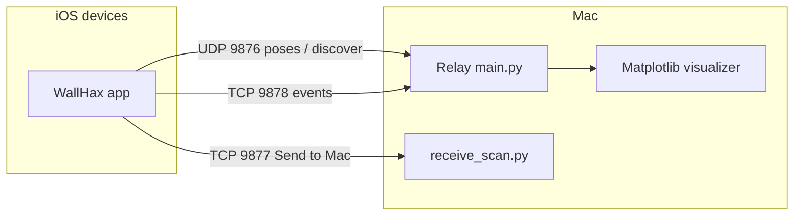

# wallhax

Multi-device AR collaboration for iOS: devices stream camera pose over the network while a Mac relay forwards packets to peers and shows live trajectories. The app supports operation layouts for military, search and rescue, and firefighter scenarios (see `wallhax/UseCase.swift` and `wallhax/operations_layout/`).

## Repository layout

| Path | Purpose |
|------|---------|
| `wallhax/` | SwiftUI / ARKit iOS app (Xcode target) |
| `server/` | UDP/TCP relay (`main.py`) and matplotlib visualizer (`visualizer.py`) |
| `mapping/` | Dataset tools: XMP → `transforms.json`, TCP receiver for phone → Mac scan export |
| `requirements.txt` | Python dependencies for the server and visualizer |

## iOS app

1. Open `wallhax.xcodeproj` in Xcode.
2. Build and run on a **physical iPhone or iPad** (ARKit is not supported in the simulator for world tracking).

To point the client at a known relay host instead of UDP broadcast discovery, set `staticServerIP` in `wallhax/NetworkingManager.swift` (optional; `nil` uses broadcast).

## Python relay server

Install dependencies from the repo root:

```bash
pip install -r requirements.txt
```

Start the relay (from the `server/` directory):

```bash
cd server && python3 main.py
```

Behavior:

- **UDP `9876`** — Clients send pose and discovery packets. The server responds to `type: discover` with `hello` and a `mission_id`, and forwards other JSON packets between registered peers.
- **TCP `9878`** — Length-prefixed JSON for richer events (e.g. detected planes, pins); messages are forwarded to other connected clients.
- A **matplotlib** window shows each client’s trajectory and updates as packets arrive.

## Mapping and datasets

### Receive scan data from the phone

On your Mac, **before** tapping **Send to Mac** in the app:

```bash
cd mapping && python3 receive_scan.py
```

This listens on **TCP `9877`** and writes files under `mapping/data/<mission_id>/<client_id>/`. (Run from `mapping/` so paths match the script’s `OUTPUT_DIR`.)

### Build a Nerfstudio-style `transforms.json`

After you have imagery and matching `.xmp` sidecars under `mapping/data/<mission>/` (per-client subfolders), merge them into a processed dataset:

```bash
cd mapping && python3 build_mission_dataset.py --mission <mission_id>
```

Output goes to `mapping/processed/<mission>/` (`transforms.json`, `images/`, optional `points.json`). The script applies an ARKit → OpenCV-style axis conversion for NeRF tooling. Example train command (from the script’s success message):

```bash
ns-train splatfacto --data mapping/processed/<mission_id>
```

## Network overview



Ports in use: **9876** (relay UDP), **9877** (TCP scan receive and related client binding), **9878** (relay TCP events).
